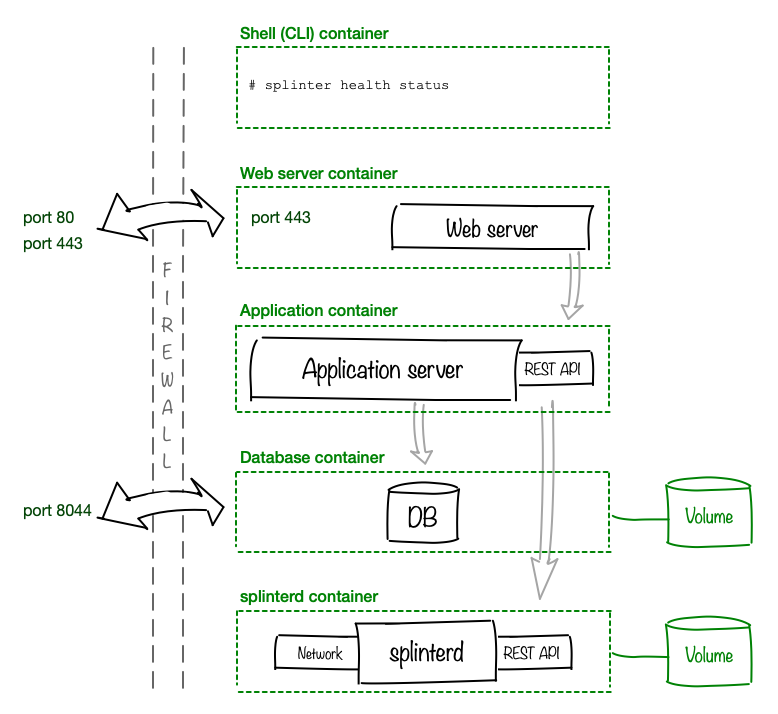
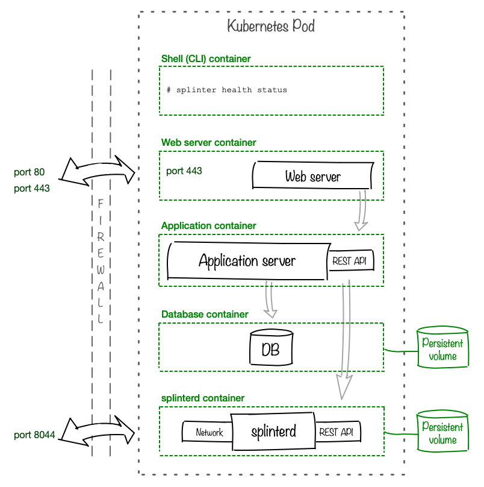

# Planning a Splinter Deployment

If you're planning to configure a new Splinter node and join a Splinter network,
 this guide explains what you need to know before you start.

Splinter works with a wide variety of deployment patterns. This guide summarizes
how to use Docker containers, a basic Kubernetes pod, and Amazon Elastic
Kubernetes Services (Amazon EKS).

**Contents**
 
[Overview](#overview)
 
[Splinter Architecture](#splinter-architecture)
 
[Network Configuration](#network-configuration)
 
[Application Pattern](#application-pattern)
 
[Docker Deployment](#docker-deployment)
 
[Basic Kubernetes Deployment](#basic-kubernetes-deployment)
 
[Amazon EKS Deployment](#amazon-eks-deployment)

## Overview

A Splinter deployment usually has the following items:

* A system (called a _node_) that runs the Splinter daemon (splinterd) and
  associated components. Splinter includes a REST API for applications to
  communicate with splinterd.

* A server-side application with a local database for storing persistent data,
  such as transaction-based changes from Splinter's _state delta export_
  function.

*   A web UI (brower-based user interface) for interacting with the application.

## Splinter Architecture

Splinter is a privacy-focused platform for distributed applications that
provides a blockchain-inspired networking environment for communication and
transactions between organizations.

Splinter provides a networking layer and services for running smart contracts so
that applications can build upon this functionality. A Splinter network allows
both network-wide shared state and private communication between two or more
participants (Splinter nodes), all managed with consensus. Splinter ensures
privacy for multi-node conversations, as well as the state shared by these
nodes, by using **circuits** and **services**.

* A **circuit** is a virtual network within the broader Splinter network that
  safely and securely enforces privacy scope boundaries. Connections are
  dynamically constructed between nodes as circuits are created.

* A **service** is an endpoint within a circuit that sends and receives private
  messages. All nodes on a circuit run the same set of services.

* **Shared state** (a database updated by smart contracts) is visible only to
  the services within a circuit.

For more information about Splinter, see the [Splinter
documentation](https://github.com/Cargill/splinter-docs/blob/master/docs/index.md).

## Network Configuration

The Splinter daemon, splinterd, communicates with other nodes on the network and
provides a REST API to expose Splinter functions and data to your application.
The Splinter daemon uses the following ports:

* **8044**: Network endpoint for node-to-node communication

* **8085**: Application communication via the splinterd
  REST API

If your Splinter node is behind a firewall, the node must be accessible from the
internet on a well-known URL. Your firewall or ingress solution must be
configured to allow inbound and outbound raw TCP traffic to port 8044.
Communication over this connection is encrypted with TLS.

> Note: Although you can run splinterd behind a firewall without opening up a
> port, it is not recommended. If splinterd cannot accept incoming connections,
> it will not receive circuit management requests from new peers; existing peers
> that have disconnected cannot reestablish their connections to your node.
> If running behind a firewall without an open port is absolutely necessary,
> see the [Splinter
> FAQ](https://github.com/Cargill/splinter-docs/blob/master/docs/faq/faq.md#can-i-run-the-splinter-daemon-behind-a-firewall-without-opening-up-a-port).

We recommend redirecting web server traffic from port 80 to port 443, which
sends all HTTP requests to the TLS port.

## Application Pattern

Users generally access the application with web-based apps that interact with
Splinter through a web server and server-side application. Splinter includes
**Canopy**, a distributed-application UI framework that dynamically loads
distributed UI components called _Saplings_. See [Canopy Application
Framework](../concepts/canopy_application_framework.md)
for more information.

The server-side application (application server) is commonly a single
application with a REST API, as shown here, but more complex designs are
possible.

A local database optionally saves Splinter data (transaction-based changes from
Splinter's state delta export function) as well as any application data that
must be persisted across restarts.

> **Important:** Splinter requires shared storage (such as a Docker volume or
> Kubernetes persistent volume) for `/var/lib/splinter`, which contains circuit
> definitions and shared state.

## Docker Deployment

In a basic Docker deployment, each component runs in a separate Docker
container. We recommend an additional container for terminal access, where you
can use the Splinter command-line interface (CLI) to interact with splinterd.

* The splinterd container requires a Docker data volume for `/var/lib/splinter`.

* If your application requires persistent data across restarts, configure a
  Docker data volume for the database container.

## Basic Kubernetes Deployment

For a basic deployment of Splinter on Kubernetes, one Pod contains the
containers for each component. Although many deployment patterns are possible,
this pattern has been tested with the Splinter examples.

* The splinterd container requires a persistent volume for `/var/lib/splinter`.

* If your application requires persistent data across restarts, configure a
  persistent volume  for the database container.

## Amazon EKS Deployment

This example of Amazon EKS deployment uses a classic load balancer (CLB) as the
ingress and Amazon Elastic Block Storage (EBS) as the backing store for
persistent volumes. Although many deployment patterns are possible, this pattern
has been tested with the Splinter examples.

* The splinterd container requires an EBS persistent volume for `/var/lib/splinter`.

* If your application requires persistent data across restarts, configure an EBS
  persistent volume  for the database container.

## Summary

This topic summarizes three basic approaches for deploying Splinter, but
many other patterns are possible. You can customize a Splinter deployment for
your organization, as long as you meet the networking requirements: Your node
is accessible from the internet on a well-known URL using **port 8044** and
server-side application communication is allowed on **port 8085**.
